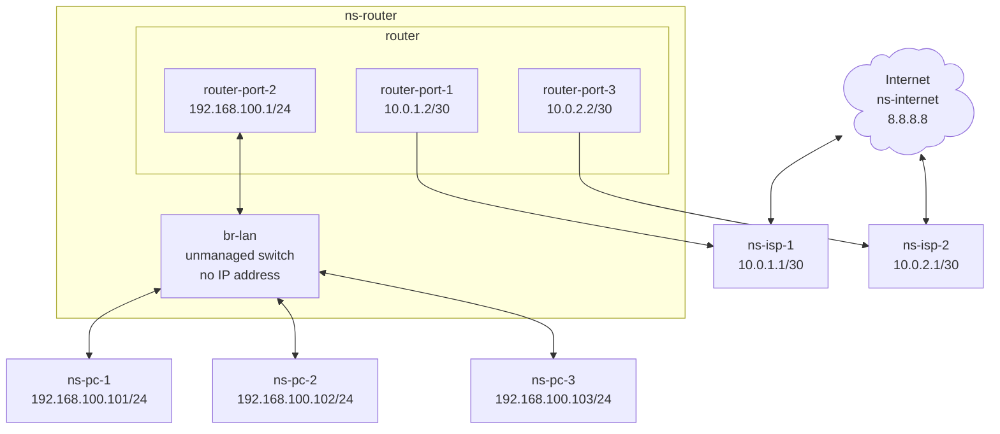

Policy Routing
===

## Table of Contents
- [Overview](#overview)
- [Requirements](#requirements)
- [Layout](#layout)
  - [Diagram](#diagram)
  - [Network Namespace](#network-namespace)
- [Hardware](#hardware-and-software)
- [Implementation](#implementation)
  - [Step 01 - Create the virtual machine](#step-01---create-the-virtual-machine)
  - [Step 02 - Create the required namespaces](#step-02---create-the-required-namespaces)
  - [Step 03 - Assign an IP address to ns-pc-1](#step-03---assign-an-ip-address-to-ns-pc-1)
  - [Step 04 - Assign an IP address to ns-router](#step-04---assign-an-ip-address-to-ns-router)
  - [Step 05 - Assign an IP address to ns-isp-1](#step-05---assign-an-ip-address-to-ns-isp-1)

## Overview
The lab uses multipass to create a virtual machine.
There will be 6 network namespaces that will be from various PC at home and a layer as mock internet.
The objective is to contrast not using policy routing vs using policy routing.
The PC at home will ping internet using the default route.
Then policy routing will be added.
The PC at home will ping internet again to show that policy routing has been implemented.


## Requirements
- [Multipass](https://canonical.com/multipass) installation.
- The vm will be created with default configuration of 1 core and 1 GB of RAM and 4 GB of disk space.

## Layout
### Diagram

### Network Namespace
- ns-internet - This will represent a common destination being accessed by different ISPs.
- ns-isp-1 and ns-isp-2 - The namespace `ns-isp-1` will be the default gateway for `ns-pc-1`, `ns-pc-2` and `ns-pc-3`. We will then introduce policy routing where `ns-pc-1` will be explicitly configured to use `ns-isp-1`, `ns-pc-2` will be explicitly configured to use `ns-isp-2` and `ns-pc-3` will use `ns-isp-1` implicitly as PC-3 was not explcitly configure with any policy routing and will use the default route.
- ns-router - The router has 3 ports:
  - 10.0.1.2/30 - This connects to `ns-isp-1`
  - 10.0.2.2/30 - This connects to `ns-isp-2`.
  - 192.168.101.1/24 - This is the gateway for `ns-pc-1`, `ns-pc-2` and `ns-pc-3`.
  - The `link` of type `bridge` will act as a non-managed switch, without any IP addresses where `ns-pc-1`, `ns-pc-2` and `ns-pc-3` connects to this `bridge`.
- ns-pc-1, ns-pc-2 and ns-pc-3 - These will represent individual devices that connect to the switch, `br-lan`.

## Hardware and Software
- This was tested on a `Beelink Mini S` with `Intel(R) N100` with `16 GB DDR4`.
- Also tested with `multipass` version `1.16.1` on M2 Mac Book Pro with 32 GB RAM.

## Implementation
### Step 01 - Create the virtual machine
Command:
```
echo  'package_update: true\npackage_upgrade: true\npackages:\n  - traceroute' | multipass launch --name lab1 --cloud-init -
```
Sample output:
```
$ echo  'package_update: true\npackage_upgrade: true\npackages:\n  - traceroute' | multipass launch --name lab1 --cloud-init -
Launched: lab1
```

### Step 02 - Create the required namespaces
Command:
```
```
Sample output:
```
```
