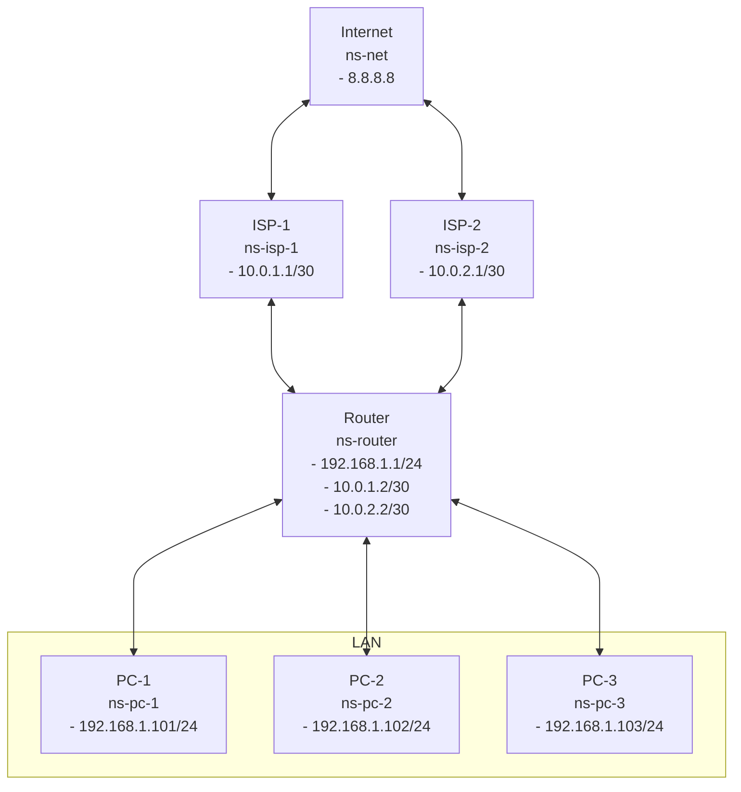

Policy Routing
===

## Table of Contents
- [Overview](#overview)
- [Requirements](#requirements)
- [Layout](#layout)
  - [Diagram](#diagram)
  - [Network Namespace](#network-namespace)

## Overview
The lab uses multipass to create a virtual machine.
There will be 7 network namespaces that will be from various PC at home and a layer as mock internet.
The objective is to contrast not using policy routing vs using policy routing.
The PC at home will ping internet using the default route.
Then policy routing will be added.
The PC at home will ping internet again to show that policy routing has been implemented.

## Requirements
- [Multipass](https://canonical.com/multipass) installation.
- The vm will be created with default configuration of 1 core and 1 GB of RAM and 4 GB of disk space.

## Layout
### Diagram

### Network Namespace
- ns-net - This is mock Internet tha will be the final destination for PC-1, PC-2 and PC-3.
- ns-isp-1 and ns-isp-2 - The namespace `ns-isp-1` will be the default gateway for PC-1, PC-2 and PC-3. We will then introduce policy routing where PC-1 will be explicitly configured to use `ns-isp-1`, PC-2 will be explicitly configured to use `ns-isp-2` and PC-3 will use `ns-isp-1` implicitly as PC-3 was not explcitly configure with any policy routing and will use the default route.
- ns-router - The router connects 3 networks together (LAN, ISP-1, ISP-2). The default route and policy routing will be configured on this interface.
- ns-pc-1, ns-pc-2 and ns-pc-3 - This will represent devices connected to `ns-router`.

