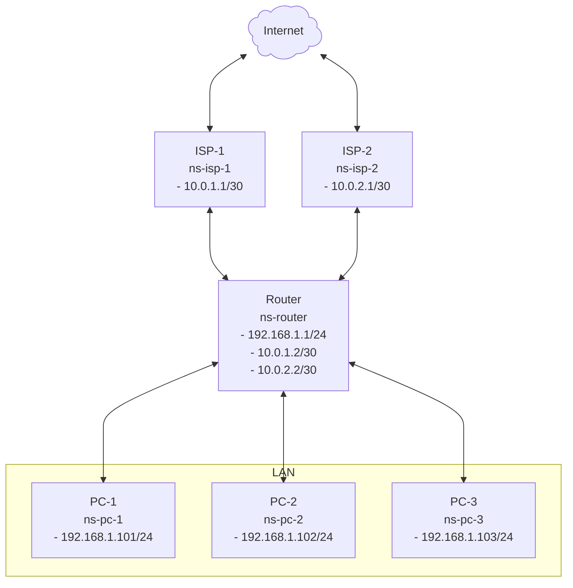

Policy Routing
===

## Table of Contents
- [Overview](#overview)
- [Requirements](#requirements)
- [Layout](#layout)
  - [Diagram](#diagram)
  - [Network Namespace](#network-namespace)
- [Hardware](#hardware)
- [Implementation](#implementation)
  - [Step 01 - Create the virtual machine](#step-01---create-the-virtual-machine)
  - [Step 02 - Create the required namespaces](#step-02---create-the-required-namespaces)
  - [Step 03 - Assign an IP address to ns-pc-1](#step-03---assign-an-ip-address-to-ns-pc-1)
  - [Step 04 - Assign an IP address to ns-router](#step-04---assign-an-ip-address-to-ns-router)
  - [Step 05 - Assign an IP address to ns-isp-1](#step-05---assign-an-ip-address-to-ns-isp-1)

## Overview
The lab uses multipass to create a virtual machine.
There will be 6 network namespaces that will be from various PC at home and a layer as mock internet.
The objective is to contrast not using policy routing vs using policy routing.
The PC at home will ping internet using the default route.
Then policy routing will be added.
The PC at home will ping internet again to show that policy routing has been implemented.


## Requirements
- [Multipass](https://canonical.com/multipass) installation.
- The vm will be created with default configuration of 1 core and 1 GB of RAM and 4 GB of disk space.

## Layout
### Diagram
```mermaid
info
```

### Network Namespace
- ns-isp-1 and ns-isp-2 - The namespace `ns-isp-1` will be the default gateway for PC-1, PC-2 and PC-3. We will then introduce policy routing where PC-1 will be explicitly configured to use `ns-isp-1`, PC-2 will be explicitly configured to use `ns-isp-2` and PC-3 will use `ns-isp-1` implicitly as PC-3 was not explcitly configure with any policy routing and will use the default route.
- ns-router - The router connects 3 networks together (LAN, ISP-1, ISP-2). The default route and policy routing will be configured on this interface.
- ns-pc-1, ns-pc-2 and ns-pc-3 - This will represent devices connected to `ns-router`.

## Hardware
This was tested on a `Beelink Mini S` with `Intel(R) N100` with `16 GB DDR4`.

## Implementation
### Step 01 - Create the virtual machine
Command:
```bash
multipass launch --name lab1
```
This will create a new virtual machine with `1 GB` RAM and 1 thread.

Run the `shell` command to access the virtual machine.
```bash
multipass shell lab1
```
### Step 02 - Create the required namespaces
Verify that there are no existing network namespaces.

```code
ubuntu@lab1:~$ ip link show type netns
```
This list will be empty.

Create 3 namespace for the 3 PC devices.
```
ubuntu@lab1:~$ sudo ip netns add ns-pc-1
ubuntu@lab1:~$ sudo ip netns add ns-pc-2
ubuntu@lab1:~$ sudo ip netns add ns-pc-3
```

Create 1 namespace for the router.
```
ubuntu@lab1:~$ sudo ip netns add ns-router
```

Verify all namespaces are present
```
ubuntu@lab1:~$ ip netns show
ns-isp-2
ns-isp-1
ns-router
ns-pc-3
ns-pc-2
ns-pc-1
```
### Step 03 - Assign an IP address to ns-pc-1
Check current IP address for `ns-pc-1`:
```
ubuntu@lab1:~$ sudo ip netns exec ns-pc-1 ip -4 -br address show
```
Nothing.

---
Check current links for `ns-pc-1`:
```
ubuntu@lab1:~$ sudo ip netns exec ns-pc-1 ip link show
1: lo: <LOOPBACK> mtu 65536 qdisc noop state DOWN mode DEFAULT group default qlen 1000
    link/loopback 00:00:00:00:00:00 brd 00:00:00:00:00:00
```
The link `lo` is down.

---
Add a new link of type `veth`. This is like a network cable with 2 endpoints. One goes `ns-pc-1` and one goes to `ns-router`.
```
ubuntu@lab1:~$ ip link show type veth
ubuntu@lab1:~$ sudo ip link add veth-pc-1-pc type veth peer name veth-pc-1-rt
ubuntu@lab1:~$ ip link show type veth
3: veth-pc-1-rt@veth-pc-1-pc: <BROADCAST,MULTICAST,M-DOWN> mtu 1500 qdisc noop state DOWN mode DEFAULT group default qlen 1000
    link/ether 5e:c2:a2:af:31:19 brd ff:ff:ff:ff:ff:ff
4: veth-pc-1-pc@veth-pc-1-rt: <BROADCAST,MULTICAST,M-DOWN> mtu 1500 qdisc noop state DOWN mode DEFAULT group default qlen 1000
    link/ether 56:c6:06:80:c2:2f brd ff:ff:ff:ff:ff:ff
```
The these are peers of each other, `veth-pc-1-rt` is the peer of `eth-pc-1-pc`.

---
Plug in the cables.
```
ubuntu@lab1:~$ ip link show type veth
3: veth-pc-1-rt@veth-pc-1-pc: <BROADCAST,MULTICAST,M-DOWN> mtu 1500 qdisc noop state DOWN mode DEFAULT group default qlen 1000
    link/ether 5e:c2:a2:af:31:19 brd ff:ff:ff:ff:ff:ff
4: veth-pc-1-pc@veth-pc-1-rt: <BROADCAST,MULTICAST,M-DOWN> mtu 1500 qdisc noop state DOWN mode DEFAULT group default qlen 1000
    link/ether 56:c6:06:80:c2:2f brd ff:ff:ff:ff:ff:ff
ubuntu@lab1:~$ sudo ip netns exec ns-router ip link show type veth
ubuntu@lab1:~$ sudo ip netns exec ns-router ip link show type veth
ubuntu@lab1:~$ sudo ip link set veth-pc-1-pc netns ns-pc-1
ubuntu@lab1:~$ sudo ip link set veth-pc-1-rt netns ns-router
ubuntu@lab1:~$ sudo ip netns exec ns-pc-1 ip link show type veth
4: veth-pc-1-pc@if3: <BROADCAST,MULTICAST> mtu 1500 qdisc noop state DOWN mode DEFAULT group default qlen 1000
    link/ether 56:c6:06:80:c2:2f brd ff:ff:ff:ff:ff:ff link-netns ns-router
ubuntu@lab1:~$ sudo ip netns exec ns-router ip link show type veth
3: veth-pc-1-rt@if4: <BROADCAST,MULTICAST> mtu 1500 qdisc noop state DOWN mode DEFAULT group default qlen 1000
    link/ether 5e:c2:a2:af:31:19 brd ff:ff:ff:ff:ff:ff link-netns ns-pc-1
ubuntu@lab1:~$ ip link show type veth
```
The link `veth-pc-1-pc` is in now in `ns-pc-1` and the link `veth-pc-1-rt` is in `ns-router`.

---
Add a bridge.
```
ubuntu@lab1:~$ sudo ip netns exec ns-router ip link show type bridge
ubuntu@lab1:~$ sudo ip netns exec ns-router ip link add br-lan type bridge
ubuntu@lab1:~$ sudo ip netns exec ns-router ip link show type bridge
2: br-lan: <BROADCAST,MULTICAST> mtu 1500 qdisc noop state DOWN mode DEFAULT group default qlen 1000
    link/ether 7e:5e:38:cf:cb:b6 brd ff:ff:ff:ff:ff:ff
ubuntu@lab1:~$ 
```
The bridge is in the namespace but the bridge is still down.

---
Plug in the cable in the namespace to the bridge:
```
ubuntu@lab1:~$ sudo ip netns exec ns-router ip link show veth-pc-1-rt
3: veth-pc-1-rt@if4: <BROADCAST,MULTICAST> mtu 1500 qdisc noop state DOWN mode DEFAULT group default qlen 1000
    link/ether 5e:c2:a2:af:31:19 brd ff:ff:ff:ff:ff:ff link-netns ns-pc-1
ubuntu@lab1:~$ sudo ip netns exec ns-router ip link show br-lan
2: br-lan: <BROADCAST,MULTICAST> mtu 1500 qdisc noop state DOWN mode DEFAULT group default qlen 1000
    link/ether 7e:5e:38:cf:cb:b6 brd ff:ff:ff:ff:ff:ff
ubuntu@lab1:~$ sudo ip netns exec ns-router ip link set veth-pc-1-rt master br-lan
ubuntu@lab1:~$ sudo ip netns exec ns-router ip link show veth-pc-1-rt
3: veth-pc-1-rt@if4: <BROADCAST,MULTICAST> mtu 1500 qdisc noop master br-lan state DOWN mode DEFAULT group default qlen 1000
    link/ether 5e:c2:a2:af:31:19 brd ff:ff:ff:ff:ff:ff link-netns ns-pc-1
ubuntu@lab1:~$ sudo ip netns exec ns-router ip link show br-lan
2: br-lan: <BROADCAST,MULTICAST> mtu 1500 qdisc noop state DOWN mode DEFAULT group default qlen 1000
    link/ether 5e:c2:a2:af:31:19 brd ff:ff:ff:ff:ff:ff
ubuntu@lab1:~$ 
```
We can see that `veth-pc-1-rt` has `master br-lan`.

---

Configure the IP address for `ns-pc-1`:
```
ubuntu@lab1:~$ sudo ip netns exec ns-pc-1 ping -c 5 -W 1 192.168.1.101
ping: connect: Network is unreachable
ubuntu@lab1:~$ sudo ip netns exec ns-pc-1 ip -br -4 address show
ubuntu@lab1:~$ sudo ip netns exec ns-pc-1 ip link show veth-pc-1-pc
4: veth-pc-1-pc@if3: <BROADCAST,MULTICAST> mtu 1500 qdisc noop state DOWN mode DEFAULT group default qlen 1000
    link/ether 56:c6:06:80:c2:2f brd ff:ff:ff:ff:ff:ff link-netns ns-router
ubuntu@lab1:~$ sudo ip netns exec ns-pc-1 ip addr add 192.168.1.101/24 dev veth-pc-1-pc
ubuntu@lab1:~$ sudo ip netns exec ns-pc-1 ip link set veth-pc-1-pc up
ubuntu@lab1:~$ sudo ip netns exec ns-pc-1 ip link set lo up
ubuntu@lab1:~$ sudo ip netns exec ns-pc-1 ping -c 5 -W 1 192.168.1.101
PING 192.168.1.101 (192.168.1.101) 56(84) bytes of data.
64 bytes from 192.168.1.101: icmp_seq=1 ttl=64 time=0.018 ms
64 bytes from 192.168.1.101: icmp_seq=2 ttl=64 time=0.073 ms
64 bytes from 192.168.1.101: icmp_seq=3 ttl=64 time=0.072 ms
64 bytes from 192.168.1.101: icmp_seq=4 ttl=64 time=0.074 ms
64 bytes from 192.168.1.101: icmp_seq=5 ttl=64 time=0.072 ms

--- 192.168.1.101 ping statistics ---
5 packets transmitted, 5 received, 0% packet loss, time 4105ms
rtt min/avg/max/mdev = 0.018/0.061/0.074/0.021 ms
ubuntu@lab1:~$ sudo ip netns exec ns-pc-1 ip -br -4 address show
lo               UNKNOWN        127.0.0.1/8 
veth-pc-1-pc@if3 LOWERLAYERDOWN 192.168.1.101/24 
ubuntu@lab1:~$ sudo ip netns exec ns-pc-1 ip link show veth-pc-1-pc
4: veth-pc-1-pc@if3: <NO-CARRIER,BROADCAST,MULTICAST,UP> mtu 1500 qdisc noqueue state LOWERLAYERDOWN mode DEFAULT group default qlen 1000
    link/ether 56:c6:06:80:c2:2f brd ff:ff:ff:ff:ff:ff link-netns ns-router
```
We have a static IP configured for `ns-pc-1`.

### Step 04 - Assign an IP address to ns-router
```
ubuntu@lab1:~$ sudo ip netns exec ns-router ping -c 5 -W 1 192.168.1.1
ping: connect: Network is unreachable
ubuntu@lab1:~$ sudo ip netns exec ns-router ip -br -4 address show
ubuntu@lab1:~$ sudo ip netns exec ns-router ip link show veth-pc-1-rt
3: veth-pc-1-rt@if4: <BROADCAST,MULTICAST> mtu 1500 qdisc noop master br-lan state DOWN mode DEFAULT group default qlen 1000
    link/ether 5e:c2:a2:af:31:19 brd ff:ff:ff:ff:ff:ff link-netns ns-pc-1
ubuntu@lab1:~$ sudo ip netns exec ns-router ip link show br-lan
2: br-lan: <BROADCAST,MULTICAST> mtu 1500 qdisc noop state DOWN mode DEFAULT group default qlen 1000
    link/ether 5e:c2:a2:af:31:19 brd ff:ff:ff:ff:ff:ff
ubuntu@lab1:~$ sudo ip netns exec ns-router ip addr add 192.168.1.1/24 dev br-lan
ubuntu@lab1:~$ sudo ip netns exec ns-router ip link set veth-pc-1-rt up
ubuntu@lab1:~$ sudo ip netns exec ns-router ip link set br-lan up
ubuntu@lab1:~$ sudo ip netns exec ns-router ip link set lo up
ubuntu@lab1:~$ sudo ip netns exec ns-router ping -c 5 -W 1 192.168.1.1
PING 192.168.1.1 (192.168.1.1) 56(84) bytes of data.
64 bytes from 192.168.1.1: icmp_seq=1 ttl=64 time=0.019 ms
64 bytes from 192.168.1.1: icmp_seq=2 ttl=64 time=0.079 ms
64 bytes from 192.168.1.1: icmp_seq=3 ttl=64 time=0.077 ms
64 bytes from 192.168.1.1: icmp_seq=4 ttl=64 time=0.077 ms
64 bytes from 192.168.1.1: icmp_seq=5 ttl=64 time=0.075 ms

--- 192.168.1.1 ping statistics ---
5 packets transmitted, 5 received, 0% packet loss, time 4121ms
rtt min/avg/max/mdev = 0.019/0.065/0.079/0.023 ms
ubuntu@lab1:~$ sudo ip netns exec ns-router ip -br -4 address show
lo               UNKNOWN        127.0.0.1/8 
br-lan           UP             192.168.1.1/24 
ubuntu@lab1:~$ sudo ip netns exec ns-router ip link show veth-pc-1-rt
3: veth-pc-1-rt@if4: <BROADCAST,MULTICAST,UP,LOWER_UP> mtu 1500 qdisc noqueue master br-lan state UP mode DEFAULT group default qlen 1000
    link/ether 5e:c2:a2:af:31:19 brd ff:ff:ff:ff:ff:ff link-netns ns-pc-1
ubuntu@lab1:~$ sudo ip netns exec ns-router ip link show br-lan
2: br-lan: <BROADCAST,MULTICAST,UP,LOWER_UP> mtu 1500 qdisc noqueue state UP mode DEFAULT group default qlen 1000
    link/ether 5e:c2:a2:af:31:19 brd ff:ff:ff:ff:ff:ff
ubuntu@lab1:~$ sudo ip netns exec ns-router ping -c 5 -W 1 192.168.1.101
PING 192.168.1.101 (192.168.1.101) 56(84) bytes of data.
64 bytes from 192.168.1.101: icmp_seq=1 ttl=64 time=0.052 ms
64 bytes from 192.168.1.101: icmp_seq=2 ttl=64 time=0.094 ms
64 bytes from 192.168.1.101: icmp_seq=3 ttl=64 time=0.092 ms
64 bytes from 192.168.1.101: icmp_seq=4 ttl=64 time=0.093 ms
64 bytes from 192.168.1.101: icmp_seq=5 ttl=64 time=0.094 ms

--- 192.168.1.101 ping statistics ---
5 packets transmitted, 5 received, 0% packet loss, time 4075ms
rtt min/avg/max/mdev = 0.052/0.085/0.094/0.016 ms
ubuntu@lab1:~$ sudo ip netns exec ns-pc-1 ping -c 5 -W 1 192.168.1.1
PING 192.168.1.1 (192.168.1.1) 56(84) bytes of data.
64 bytes from 192.168.1.1: icmp_seq=1 ttl=64 time=0.024 ms
64 bytes from 192.168.1.1: icmp_seq=2 ttl=64 time=0.098 ms
64 bytes from 192.168.1.1: icmp_seq=3 ttl=64 time=0.095 ms
64 bytes from 192.168.1.1: icmp_seq=4 ttl=64 time=0.095 ms
64 bytes from 192.168.1.1: icmp_seq=5 ttl=64 time=0.096 ms

--- 192.168.1.1 ping statistics ---
5 packets transmitted, 5 received, 0% packet loss, time 4091ms
rtt min/avg/max/mdev = 0.024/0.081/0.098/0.028 ms
ubuntu@lab1:~$ sudo ip netns exec ns-pc-1 ip -br -4 address show
lo               UNKNOWN        127.0.0.1/8 
veth-pc-1-pc@if3 UP             192.168.1.101/24 
ubuntu@lab1:~$ 

```
- The bridge `br-lan` in the namespace `ns-router` with the IP `192.168.1.1` can ping the IP `192.168.1.101`.
- The link `veth-pc-1-pc` that was `LOWERLAYERDOWN` is now `UP`.
### Step 05 - Assign an IP address to ns-isp-1
```
ubuntu@lab1:~$ ip link show type veth
ubuntu@lab1:~$ sudo ip link add veth-isp-1-in type veth peer name veth-isp-1-rt
ubuntu@lab1:~$ ip link show type veth
5: veth-isp-1-rt@veth-isp-1-in: <BROADCAST,MULTICAST,M-DOWN> mtu 1500 qdisc noop state DOWN mode DEFAULT group default qlen 1000
    link/ether 02:e4:01:18:f1:c6 brd ff:ff:ff:ff:ff:ff
6: veth-isp-1-in@veth-isp-1-rt: <BROADCAST,MULTICAST,M-DOWN> mtu 1500 qdisc noop state DOWN mode DEFAULT group default qlen 1000
    link/ether 6e:ae:b3:8c:c8:d7 brd ff:ff:ff:ff:ff:ff
ubuntu@lab1:~$ sudo ip netns exec ns-isp-1 ip link show type veth
ubuntu@lab1:~$ sudo ip netns exec ns-router ip link show type veth
3: veth-pc-1-rt@if4: <BROADCAST,MULTICAST,UP,LOWER_UP> mtu 1500 qdisc noqueue master br-lan state UP mode DEFAULT group default qlen 1000
    link/ether 5e:c2:a2:af:31:19 brd ff:ff:ff:ff:ff:ff link-netns ns-pc-1
ubuntu@lab1:~$ sudo ip link set veth-isp-1-in netns ns-isp-1
ubuntu@lab1:~$ sudo ip link set veth-isp-1-rt netns ns-router
ubuntu@lab1:~$ ip link show type veth
ubuntu@lab1:~$ sudo ip netns exec ns-isp-1 ip link show type veth
6: veth-isp-1-in@if5: <BROADCAST,MULTICAST> mtu 1500 qdisc noop state DOWN mode DEFAULT group default qlen 1000
    link/ether 6e:ae:b3:8c:c8:d7 brd ff:ff:ff:ff:ff:ff link-netns ns-router
ubuntu@lab1:~$ sudo ip netns exec ns-router ip link show type veth
3: veth-pc-1-rt@if4: <BROADCAST,MULTICAST,UP,LOWER_UP> mtu 1500 qdisc noqueue master br-lan state UP mode DEFAULT group default qlen 1000
    link/ether 5e:c2:a2:af:31:19 brd ff:ff:ff:ff:ff:ff link-netns ns-pc-1
5: veth-isp-1-rt@if6: <BROADCAST,MULTICAST> mtu 1500 qdisc noop state DOWN mode DEFAULT group default qlen 1000
    link/ether 02:e4:01:18:f1:c6 brd ff:ff:ff:ff:ff:ff link-netns ns-isp-1
```
- Create the cable with `veth-isp-1-in` on one end and `veth-isp-1-rt` on the other end.
- Associate `veth-isp-1-in` with `ns-isp-1`.
- Associate `veth-isp-1-rt` with `ns-router`.

---


