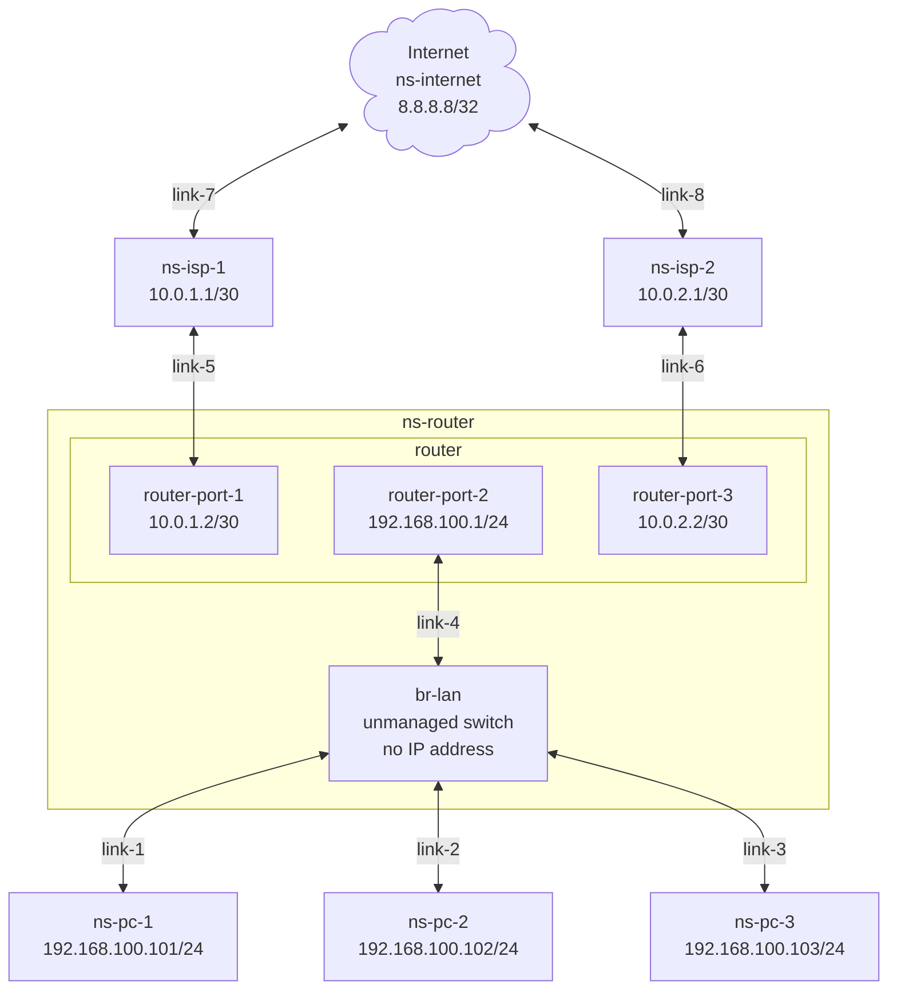

Policy Routing
===

## Table of Contents
- [Overview](#overview)
- [Requirements](#requirements)
- [Layout](#layout)
  - [Diagram](#diagram)
  - [Network Namespace](#network-namespace)
- [Hardware](#hardware-and-software)
- [Implementation](#implementation)
  - [Step 01 - Create the virtual machine](#step-01---create-the-virtual-machine)
  - [Step 02 - Access the vm](#step-02---access-the-vm)
  - [Step 03 - Create the required namespaces](#step-03---create-the-required-namespaces)
  - [Step 04 - Create the required links](#step-04---create-the-required-links)
  - [Step 05 - Assign IP addresses](#step-05---assign-ip-addresses)
  - [Step 06 - Configure PC Gateway](#step-06---configure-pc-gateway)

## Overview
The lab uses multipass to create a virtual machine.
There will be 6 network namespaces that will be from various PC at home and a layer as mock internet.
The objective is to contrast not using policy routing vs using policy routing.
The PC at home will ping internet using the default route.
Then policy routing will be added.
The PC at home will ping internet again to show that policy routing has been implemented.


## Requirements
- [Multipass](https://canonical.com/multipass) installation.
- The vm will be created with default configuration of 1 core and 1 GB of RAM and 4 GB of disk space.

## Layout
### Diagram

### Network Namespace
- ns-internet - This will represent a common destination being accessed by different ISPs.
- ns-isp-1 and ns-isp-2 - The namespace `ns-isp-1` will be the default gateway for `ns-pc-1`, `ns-pc-2` and `ns-pc-3`. We will then introduce policy routing where `ns-pc-1` will be explicitly configured to use `ns-isp-1`, `ns-pc-2` will be explicitly configured to use `ns-isp-2` and `ns-pc-3` will use `ns-isp-1` implicitly as PC-3 was not explcitly configure with any policy routing and will use the default route.
- ns-router - The router has 3 ports:
  - 10.0.1.2/30 - This connects to `ns-isp-1`
  - 10.0.2.2/30 - This connects to `ns-isp-2`.
  - 192.168.101.1/24 - This is the gateway for `ns-pc-1`, `ns-pc-2` and `ns-pc-3`.
  - The `link` of type `bridge` will act as a non-managed switch, without any IP addresses where `ns-pc-1`, `ns-pc-2` and `ns-pc-3` connects to this `bridge`.
- ns-pc-1, ns-pc-2 and ns-pc-3 - These will represent individual devices that connect to the switch, `br-lan`.

## Hardware and Software
- This was tested on a `Beelink Mini S` with `Intel(R) N100` with `16 GB DDR4`.
- Also tested with `multipass` version `1.16.1` on M2 Mac Book Pro with 32 GB RAM.

## Implementation
### Step 01 - Create the virtual machine
Command:
```
echo  'package_update: true\npackage_upgrade: true\npackages:\n  - traceroute' | multipass launch --name lab1 --cloud-init -
```
Sample output:
```
$ echo  'package_update: true\npackage_upgrade: true\npackages:\n  - traceroute' | multipass launch --name lab1 --cloud-init -
Launched: lab1
```

### Step 02 - Access the vm
Command:
```
multipass shell lab1
```
Sample output:
```
$ multipass shell lab1
Welcome to Ubuntu 24.04.3 LTS (GNU/Linux 6.8.0-90-generic aarch64)

 * Documentation:  https://help.ubuntu.com
 * Management:     https://landscape.canonical.com
 * Support:        https://ubuntu.com/pro

 System information as of Tue Dec 23 18:35:49 MST 2025

  System load:             0.0
  Usage of /:              52.3% of 3.80GB
  Memory usage:            20%
  Swap usage:              0%
  Processes:               94
  Users logged in:         0
  IPv4 address for enp0s1: 192.168.2.8
  IPv6 address for enp0s1: fde8:bf1d:8203:1850:5054:ff:fe92:d4cc


Expanded Security Maintenance for Applications is not enabled.

0 updates can be applied immediately.

Enable ESM Apps to receive additional future security updates.
See https://ubuntu.com/esm or run: sudo pro status


To run a command as administrator (user "root"), use "sudo <command>".
See "man sudo_root" for details.

ubuntu@lab1:~$ 
```
### Step 03 - Create the required namespaces
```
ip netns list
sudo ip netns add ns-internet
sudo ip netns add ns-isp-1
sudo ip netns add ns-isp-2
sudo ip netns add ns-router
sudo ip netns add ns-pc-1
sudo ip netns add ns-pc-2
sudo ip netns add ns-pc-3
ip netns list
```
Sample output:
```
ubuntu@lab1:~$ ip netns list
ubuntu@lab1:~$ sudo ip netns add ns-internet
ubuntu@lab1:~$ sudo ip netns add ns-isp-1
ubuntu@lab1:~$ sudo ip netns add ns-isp-2
ubuntu@lab1:~$ sudo ip netns add ns-router
ubuntu@lab1:~$ sudo ip netns add ns-pc-1
ubuntu@lab1:~$ sudo ip netns add ns-pc-2
ubuntu@lab1:~$ sudo ip netns add ns-pc-3
ubuntu@lab1:~$ ip netns list
ns-pc-3
ns-pc-2
ns-pc-1
ns-router
ns-isp-2
ns-isp-1
ns-internet
ubuntu@lab1:~$ 
```
### Step 04 - Create the required links
Create link of type `bridge` named `br-lan` in the `ns-router` namespace:
```
sudo ip netns exec ns-router ip link show type bridge
sudo ip netns exec ns-router ip link add br-lan type bridge
sudo ip netns exec ns-router ip link show type bridge
```
Sample output:
```
ubuntu@lab1:~$ sudo ip netns exec ns-router ip link show type bridge
ubuntu@lab1:~$ sudo ip netns exec ns-router ip link add br-lan type bridge
ubuntu@lab1:~$ sudo ip netns exec ns-router ip link show type bridge
2: br-lan: <BROADCAST,MULTICAST> mtu 1500 qdisc noop state DOWN mode DEFAULT group default qlen 1000
    link/ether 1e:76:75:b4:3e:b5 brd ff:ff:ff:ff:ff:ff
```
---
Create link of type `bridge` named `br-internet` in the `ns-internet` namespace:
```
sudo ip netns exec ns-internet ip link show type bridge
sudo ip netns exec ns-internet ip link add br-internet type bridge
sudo ip netns exec ns-internet ip link show type bridge
```
Sample output:
```
ubuntu@lab1:~$ sudo ip netns exec ns-internet ip link show type bridge
ubuntu@lab1:~$ sudo ip netns exec ns-internet ip link add br-internet type bridge
ubuntu@lab1:~$ sudo ip netns exec ns-internet ip link show type bridge
2: br-internet: <BROADCAST,MULTICAST> mtu 1500 qdisc noop state DOWN mode DEFAULT group default qlen 1000
    link/ether 52:cc:6e:d6:d9:52 brd ff:ff:ff:ff:ff:ff
```
---
- Create 3 links of type `veth` for the connections between `br-lan` and `ns-pc-1`/`ns-pc-2`/`ns-pc-3`.
- Create 1 link of type `veth` for the connections between `br-lan` and `ns-router`.
- Create 2 links of type `veth` for the connections between `ns-router` and `ns-isp-1`/`ns-isp-2`.
- Create 2 links of type `veth` for the connections between `ns-internet` and `ns-isp-1`/`ns-isp-2`.
```
ip link show type veth
sudo ip link add veth-1a type veth peer name veth-1b
sudo ip link add veth-2a type veth peer name veth-2b
sudo ip link add veth-3a type veth peer name veth-3b
sudo ip link add veth-4a type veth peer name veth-4b
sudo ip link add veth-5a type veth peer name veth-5b
sudo ip link add veth-6a type veth peer name veth-6b
sudo ip link add veth-7a type veth peer name veth-7b
sudo ip link add veth-8a type veth peer name veth-8b
ip link show type veth
```
Sample output:
```
ubuntu@lab1:~$ ip link show type veth
ubuntu@lab1:~$ sudo ip link add veth-1a type veth peer name veth-1b
ubuntu@lab1:~$ sudo ip link add veth-2a type veth peer name veth-2b
ubuntu@lab1:~$ sudo ip link add veth-3a type veth peer name veth-3b
ubuntu@lab1:~$ sudo ip link add veth-4a type veth peer name veth-4b
ubuntu@lab1:~$ sudo ip link add veth-5a type veth peer name veth-5b
ubuntu@lab1:~$ sudo ip link add veth-6a type veth peer name veth-6b
ubuntu@lab1:~$ sudo ip link add veth-7a type veth peer name veth-7b
ubuntu@lab1:~$ sudo ip link add veth-8a type veth peer name veth-8b
ubuntu@lab1:~$ ip link show type veth
3: veth-1b@veth-1a: <BROADCAST,MULTICAST,M-DOWN> mtu 1500 qdisc noop state DOWN mode DEFAULT group default qlen 1000
    link/ether ee:ab:46:f4:d8:a8 brd ff:ff:ff:ff:ff:ff
4: veth-1a@veth-1b: <BROADCAST,MULTICAST,M-DOWN> mtu 1500 qdisc noop state DOWN mode DEFAULT group default qlen 1000
    link/ether 7e:61:d6:33:66:1e brd ff:ff:ff:ff:ff:ff
5: veth-2b@veth-2a: <BROADCAST,MULTICAST,M-DOWN> mtu 1500 qdisc noop state DOWN mode DEFAULT group default qlen 1000
    link/ether 76:56:fe:8d:f2:e2 brd ff:ff:ff:ff:ff:ff
6: veth-2a@veth-2b: <BROADCAST,MULTICAST,M-DOWN> mtu 1500 qdisc noop state DOWN mode DEFAULT group default qlen 1000
    link/ether 1a:6a:a3:03:c3:be brd ff:ff:ff:ff:ff:ff
7: veth-3b@veth-3a: <BROADCAST,MULTICAST,M-DOWN> mtu 1500 qdisc noop state DOWN mode DEFAULT group default qlen 1000
    link/ether c6:5a:f5:49:8d:10 brd ff:ff:ff:ff:ff:ff
8: veth-3a@veth-3b: <BROADCAST,MULTICAST,M-DOWN> mtu 1500 qdisc noop state DOWN mode DEFAULT group default qlen 1000
    link/ether 1a:d4:40:5c:78:5e brd ff:ff:ff:ff:ff:ff
9: veth-4b@veth-4a: <BROADCAST,MULTICAST,M-DOWN> mtu 1500 qdisc noop state DOWN mode DEFAULT group default qlen 1000
    link/ether 1e:de:51:59:4f:66 brd ff:ff:ff:ff:ff:ff
10: veth-4a@veth-4b: <BROADCAST,MULTICAST,M-DOWN> mtu 1500 qdisc noop state DOWN mode DEFAULT group default qlen 1000
    link/ether 46:7c:fb:6f:17:a0 brd ff:ff:ff:ff:ff:ff
11: veth-5b@veth-5a: <BROADCAST,MULTICAST,M-DOWN> mtu 1500 qdisc noop state DOWN mode DEFAULT group default qlen 1000
    link/ether 06:0b:a6:88:8b:12 brd ff:ff:ff:ff:ff:ff
12: veth-5a@veth-5b: <BROADCAST,MULTICAST,M-DOWN> mtu 1500 qdisc noop state DOWN mode DEFAULT group default qlen 1000
    link/ether aa:ab:21:11:2e:e7 brd ff:ff:ff:ff:ff:ff
13: veth-6b@veth-6a: <BROADCAST,MULTICAST,M-DOWN> mtu 1500 qdisc noop state DOWN mode DEFAULT group default qlen 1000
    link/ether 3a:23:5b:63:39:27 brd ff:ff:ff:ff:ff:ff
14: veth-6a@veth-6b: <BROADCAST,MULTICAST,M-DOWN> mtu 1500 qdisc noop state DOWN mode DEFAULT group default qlen 1000
    link/ether be:6b:59:1b:d0:16 brd ff:ff:ff:ff:ff:ff
15: veth-7b@veth-7a: <BROADCAST,MULTICAST,M-DOWN> mtu 1500 qdisc noop state DOWN mode DEFAULT group default qlen 1000
    link/ether 96:81:ea:2d:5b:ee brd ff:ff:ff:ff:ff:ff
16: veth-7a@veth-7b: <BROADCAST,MULTICAST,M-DOWN> mtu 1500 qdisc noop state DOWN mode DEFAULT group default qlen 1000
    link/ether fe:5d:04:b6:9b:06 brd ff:ff:ff:ff:ff:ff
17: veth-8b@veth-8a: <BROADCAST,MULTICAST,M-DOWN> mtu 1500 qdisc noop state DOWN mode DEFAULT group default qlen 1000
    link/ether 5a:35:ee:5b:f5:07 brd ff:ff:ff:ff:ff:ff
18: veth-8a@veth-8b: <BROADCAST,MULTICAST,M-DOWN> mtu 1500 qdisc noop state DOWN mode DEFAULT group default qlen 1000
    link/ether 2a:a7:be:5b:c5:10 brd ff:ff:ff:ff:ff:ff
```
---
Assign the link to the correct namespaces:
```
ip link show type veth
sudo ip netns exec ns-router ip link show type veth
sudo ip netns exec ns-pc-1 ip link show type veth
sudo ip netns exec ns-pc-2 ip link show type veth
sudo ip netns exec ns-pc-3 ip link show type veth
sudo ip netns exec ns-isp-1 ip link show type veth
sudo ip netns exec ns-isp-2 ip link show type veth
sudo ip netns exec ns-internet ip link show type veth

sudo ip link set veth-1a netns ns-pc-1
sudo ip link set veth-2a netns ns-pc-2
sudo ip link set veth-3a netns ns-pc-3
sudo ip link set veth-1b netns ns-router
sudo ip link set veth-2b netns ns-router
sudo ip link set veth-3b netns ns-router
sudo ip link set veth-4a netns ns-router
sudo ip link set veth-4b netns ns-router
sudo ip link set veth-5a netns ns-router
sudo ip link set veth-6a netns ns-router
sudo ip link set veth-5b netns ns-isp-1
sudo ip link set veth-6b netns ns-isp-2
sudo ip link set veth-7a netns ns-isp-1
sudo ip link set veth-8a netns ns-isp-2
sudo ip link set veth-7b netns ns-internet
sudo ip link set veth-8b netns ns-internet

ip link show type veth
sudo ip netns exec ns-router ip link show type veth
sudo ip netns exec ns-pc-1 ip link show type veth
sudo ip netns exec ns-pc-2 ip link show type veth
sudo ip netns exec ns-pc-3 ip link show type veth
sudo ip netns exec ns-isp-1 ip link show type veth
sudo ip netns exec ns-isp-2 ip link show type veth
sudo ip netns exec ns-internet ip link show type veth
```
Sample output:
```
ubuntu@lab1:~$ ip link show type veth
3: veth-1b@veth-1a: <BROADCAST,MULTICAST,M-DOWN> mtu 1500 qdisc noop state DOWN mode DEFAULT group default qlen 1000
    link/ether ee:ab:46:f4:d8:a8 brd ff:ff:ff:ff:ff:ff
4: veth-1a@veth-1b: <BROADCAST,MULTICAST,M-DOWN> mtu 1500 qdisc noop state DOWN mode DEFAULT group default qlen 1000
    link/ether 7e:61:d6:33:66:1e brd ff:ff:ff:ff:ff:ff
5: veth-2b@veth-2a: <BROADCAST,MULTICAST,M-DOWN> mtu 1500 qdisc noop state DOWN mode DEFAULT group default qlen 1000
    link/ether 76:56:fe:8d:f2:e2 brd ff:ff:ff:ff:ff:ff
6: veth-2a@veth-2b: <BROADCAST,MULTICAST,M-DOWN> mtu 1500 qdisc noop state DOWN mode DEFAULT group default qlen 1000
    link/ether 1a:6a:a3:03:c3:be brd ff:ff:ff:ff:ff:ff
7: veth-3b@veth-3a: <BROADCAST,MULTICAST,M-DOWN> mtu 1500 qdisc noop state DOWN mode DEFAULT group default qlen 1000
    link/ether c6:5a:f5:49:8d:10 brd ff:ff:ff:ff:ff:ff
8: veth-3a@veth-3b: <BROADCAST,MULTICAST,M-DOWN> mtu 1500 qdisc noop state DOWN mode DEFAULT group default qlen 1000
    link/ether 1a:d4:40:5c:78:5e brd ff:ff:ff:ff:ff:ff
9: veth-4b@veth-4a: <BROADCAST,MULTICAST,M-DOWN> mtu 1500 qdisc noop state DOWN mode DEFAULT group default qlen 1000
    link/ether 1e:de:51:59:4f:66 brd ff:ff:ff:ff:ff:ff
10: veth-4a@veth-4b: <BROADCAST,MULTICAST,M-DOWN> mtu 1500 qdisc noop state DOWN mode DEFAULT group default qlen 1000
    link/ether 46:7c:fb:6f:17:a0 brd ff:ff:ff:ff:ff:ff
11: veth-5b@veth-5a: <BROADCAST,MULTICAST,M-DOWN> mtu 1500 qdisc noop state DOWN mode DEFAULT group default qlen 1000
    link/ether 06:0b:a6:88:8b:12 brd ff:ff:ff:ff:ff:ff
12: veth-5a@veth-5b: <BROADCAST,MULTICAST,M-DOWN> mtu 1500 qdisc noop state DOWN mode DEFAULT group default qlen 1000
    link/ether aa:ab:21:11:2e:e7 brd ff:ff:ff:ff:ff:ff
13: veth-6b@veth-6a: <BROADCAST,MULTICAST,M-DOWN> mtu 1500 qdisc noop state DOWN mode DEFAULT group default qlen 1000
    link/ether 3a:23:5b:63:39:27 brd ff:ff:ff:ff:ff:ff
14: veth-6a@veth-6b: <BROADCAST,MULTICAST,M-DOWN> mtu 1500 qdisc noop state DOWN mode DEFAULT group default qlen 1000
    link/ether be:6b:59:1b:d0:16 brd ff:ff:ff:ff:ff:ff
15: veth-7b@veth-7a: <BROADCAST,MULTICAST,M-DOWN> mtu 1500 qdisc noop state DOWN mode DEFAULT group default qlen 1000
    link/ether 96:81:ea:2d:5b:ee brd ff:ff:ff:ff:ff:ff
16: veth-7a@veth-7b: <BROADCAST,MULTICAST,M-DOWN> mtu 1500 qdisc noop state DOWN mode DEFAULT group default qlen 1000
    link/ether fe:5d:04:b6:9b:06 brd ff:ff:ff:ff:ff:ff
17: veth-8b@veth-8a: <BROADCAST,MULTICAST,M-DOWN> mtu 1500 qdisc noop state DOWN mode DEFAULT group default qlen 1000
    link/ether 5a:35:ee:5b:f5:07 brd ff:ff:ff:ff:ff:ff
18: veth-8a@veth-8b: <BROADCAST,MULTICAST,M-DOWN> mtu 1500 qdisc noop state DOWN mode DEFAULT group default qlen 1000
    link/ether 2a:a7:be:5b:c5:10 brd ff:ff:ff:ff:ff:ff
ubuntu@lab1:~$ sudo ip netns exec ns-router ip link show type veth
ubuntu@lab1:~$ sudo ip netns exec ns-pc-1 ip link show type veth
ubuntu@lab1:~$ sudo ip netns exec ns-pc-2 ip link show type veth
ubuntu@lab1:~$ sudo ip netns exec ns-pc-3 ip link show type veth
ubuntu@lab1:~$ sudo ip netns exec ns-isp-1 ip link show type veth
ubuntu@lab1:~$ sudo ip netns exec ns-isp-2 ip link show type veth
ubuntu@lab1:~$ sudo ip netns exec ns-internet ip link show type veth
ubuntu@lab1:~$ sudo ip link set veth-1a netns ns-pc-1
ubuntu@lab1:~$ sudo ip link set veth-2a netns ns-pc-2
ubuntu@lab1:~$ sudo ip link set veth-3a netns ns-pc-3
ubuntu@lab1:~$ sudo ip link set veth-1b netns ns-router
ubuntu@lab1:~$ sudo ip link set veth-2b netns ns-router
ubuntu@lab1:~$ sudo ip link set veth-3b netns ns-router
ubuntu@lab1:~$ sudo ip link set veth-4a netns ns-router
ubuntu@lab1:~$ sudo ip link set veth-4b netns ns-router
ubuntu@lab1:~$ sudo ip link set veth-5a netns ns-router
ubuntu@lab1:~$ sudo ip link set veth-6a netns ns-router
ubuntu@lab1:~$ sudo ip link set veth-5b netns ns-isp-1
ubuntu@lab1:~$ sudo ip link set veth-6b netns ns-isp-2
ubuntu@lab1:~$ sudo ip link set veth-7a netns ns-isp-1
ubuntu@lab1:~$ sudo ip link set veth-8a netns ns-isp-2
ubuntu@lab1:~$ sudo ip link set veth-7b netns ns-internet
ubuntu@lab1:~$ sudo ip link set veth-8b netns ns-internet
ubuntu@lab1:~$ ip link show type veth
ubuntu@lab1:~$ sudo ip netns exec ns-router ip link show type veth
3: veth-1b@if4: <BROADCAST,MULTICAST> mtu 1500 qdisc noop state DOWN mode DEFAULT group default qlen 1000
    link/ether ee:ab:46:f4:d8:a8 brd ff:ff:ff:ff:ff:ff link-netns ns-pc-1
5: veth-2b@if6: <BROADCAST,MULTICAST> mtu 1500 qdisc noop state DOWN mode DEFAULT group default qlen 1000
    link/ether 76:56:fe:8d:f2:e2 brd ff:ff:ff:ff:ff:ff link-netns ns-pc-2
7: veth-3b@if8: <BROADCAST,MULTICAST> mtu 1500 qdisc noop state DOWN mode DEFAULT group default qlen 1000
    link/ether c6:5a:f5:49:8d:10 brd ff:ff:ff:ff:ff:ff link-netns ns-pc-3
9: veth-4b@veth-4a: <BROADCAST,MULTICAST,M-DOWN> mtu 1500 qdisc noop state DOWN mode DEFAULT group default qlen 1000
    link/ether 1e:de:51:59:4f:66 brd ff:ff:ff:ff:ff:ff
10: veth-4a@veth-4b: <BROADCAST,MULTICAST,M-DOWN> mtu 1500 qdisc noop state DOWN mode DEFAULT group default qlen 1000
    link/ether 46:7c:fb:6f:17:a0 brd ff:ff:ff:ff:ff:ff
12: veth-5a@if11: <BROADCAST,MULTICAST> mtu 1500 qdisc noop state DOWN mode DEFAULT group default qlen 1000
    link/ether aa:ab:21:11:2e:e7 brd ff:ff:ff:ff:ff:ff link-netns ns-isp-1
14: veth-6a@if13: <BROADCAST,MULTICAST> mtu 1500 qdisc noop state DOWN mode DEFAULT group default qlen 1000
    link/ether be:6b:59:1b:d0:16 brd ff:ff:ff:ff:ff:ff link-netns ns-isp-2
ubuntu@lab1:~$ sudo ip netns exec ns-pc-1 ip link show type veth
4: veth-1a@if3: <BROADCAST,MULTICAST> mtu 1500 qdisc noop state DOWN mode DEFAULT group default qlen 1000
    link/ether 7e:61:d6:33:66:1e brd ff:ff:ff:ff:ff:ff link-netns ns-router
ubuntu@lab1:~$ sudo ip netns exec ns-pc-2 ip link show type veth
6: veth-2a@if5: <BROADCAST,MULTICAST> mtu 1500 qdisc noop state DOWN mode DEFAULT group default qlen 1000
    link/ether 1a:6a:a3:03:c3:be brd ff:ff:ff:ff:ff:ff link-netns ns-router
ubuntu@lab1:~$ sudo ip netns exec ns-pc-3 ip link show type veth
8: veth-3a@if7: <BROADCAST,MULTICAST> mtu 1500 qdisc noop state DOWN mode DEFAULT group default qlen 1000
    link/ether 1a:d4:40:5c:78:5e brd ff:ff:ff:ff:ff:ff link-netns ns-router
ubuntu@lab1:~$ sudo ip netns exec ns-isp-1 ip link show type veth
11: veth-5b@if12: <BROADCAST,MULTICAST> mtu 1500 qdisc noop state DOWN mode DEFAULT group default qlen 1000
    link/ether 06:0b:a6:88:8b:12 brd ff:ff:ff:ff:ff:ff link-netns ns-router
16: veth-7a@if15: <BROADCAST,MULTICAST> mtu 1500 qdisc noop state DOWN mode DEFAULT group default qlen 1000
    link/ether fe:5d:04:b6:9b:06 brd ff:ff:ff:ff:ff:ff link-netns ns-internet
ubuntu@lab1:~$ sudo ip netns exec ns-isp-2 ip link show type veth
13: veth-6b@if14: <BROADCAST,MULTICAST> mtu 1500 qdisc noop state DOWN mode DEFAULT group default qlen 1000
    link/ether 3a:23:5b:63:39:27 brd ff:ff:ff:ff:ff:ff link-netns ns-router
18: veth-8a@if17: <BROADCAST,MULTICAST> mtu 1500 qdisc noop state DOWN mode DEFAULT group default qlen 1000
    link/ether 2a:a7:be:5b:c5:10 brd ff:ff:ff:ff:ff:ff link-netns ns-internet
ubuntu@lab1:~$ sudo ip netns exec ns-internet ip link show type veth
15: veth-7b@if16: <BROADCAST,MULTICAST> mtu 1500 qdisc noop state DOWN mode DEFAULT group default qlen 1000
    link/ether 96:81:ea:2d:5b:ee brd ff:ff:ff:ff:ff:ff link-netns ns-isp-1
17: veth-8b@if18: <BROADCAST,MULTICAST> mtu 1500 qdisc noop state DOWN mode DEFAULT group default qlen 1000
    link/ether 5a:35:ee:5b:f5:07 brd ff:ff:ff:ff:ff:ff link-netns ns-isp-2
```
### Step 05 - Assign IP addresses
Command:
```
sudo ip netns exec ns-pc-1 ip -4 -br address
sudo ip netns exec ns-pc-2 ip -4 -br address
sudo ip netns exec ns-pc-3 ip -4 -br address
sudo ip netns exec ns-router ip -4 -br address
sudo ip netns exec ns-isp-1 ip -4 -br address
sudo ip netns exec ns-isp-2 ip -4 -br address
sudo ip netns exec ns-internet ip -4 -br address

sudo ip netns exec ns-pc-1 ip add add 192.168.100.101/24 dev veth-1a
sudo ip netns exec ns-pc-2 ip add add 192.168.100.102/24 dev veth-2a
sudo ip netns exec ns-pc-3 ip add add 192.168.100.103/24 dev veth-3a
sudo ip netns exec ns-router ip add add 192.168.100.1/24 dev veth-4b
sudo ip netns exec ns-router ip add add 10.0.1.2/30 dev veth-5a
sudo ip netns exec ns-router ip add add 10.0.2.2/30 dev veth-6a
sudo ip netns exec ns-isp-1 ip add add 10.0.1.1/30 dev veth-5b
sudo ip netns exec ns-isp-2 ip add add 10.0.2.1/30 dev veth-6b
sudo ip netns exec ns-internet ip add add 8.8.8.8/32 dev br-internet

sudo ip netns exec ns-pc-1 ip -4 -br address
sudo ip netns exec ns-pc-2 ip -4 -br address
sudo ip netns exec ns-pc-3 ip -4 -br address
sudo ip netns exec ns-router ip -4 -br address
sudo ip netns exec ns-isp-1 ip -4 -br address
sudo ip netns exec ns-isp-2 ip -4 -br address
sudo ip netns exec ns-internet ip -4 -br address
```
Sample output:
```
ubuntu@lab1:~$ sudo ip netns exec ns-pc-1 ip -4 -br address
ubuntu@lab1:~$ sudo ip netns exec ns-pc-2 ip -4 -br address
ubuntu@lab1:~$ sudo ip netns exec ns-pc-3 ip -4 -br address
ubuntu@lab1:~$ sudo ip netns exec ns-router ip -4 -br address
ubuntu@lab1:~$ sudo ip netns exec ns-isp-1 ip -4 -br address
ubuntu@lab1:~$ sudo ip netns exec ns-isp-2 ip -4 -br address
ubuntu@lab1:~$ sudo ip netns exec ns-internet ip -4 -br address
ubuntu@lab1:~$ sudo ip netns exec ns-pc-1 ip add add 192.168.100.101/24 dev veth-1a
ubuntu@lab1:~$ sudo ip netns exec ns-pc-2 ip add add 192.168.100.102/24 dev veth-2a
ubuntu@lab1:~$ sudo ip netns exec ns-pc-3 ip add add 192.168.100.103/24 dev veth-3a
ubuntu@lab1:~$ sudo ip netns exec ns-router ip add add 192.168.100.1/24 dev veth-4b
ubuntu@lab1:~$ sudo ip netns exec ns-router ip add add 10.0.1.2/30 dev veth-5a
ubuntu@lab1:~$ sudo ip netns exec ns-router ip add add 10.0.2.2/30 dev veth-6a
ubuntu@lab1:~$ sudo ip netns exec ns-isp-1 ip add add 10.0.1.1/30 dev veth-5b
ubuntu@lab1:~$ sudo ip netns exec ns-isp-2 ip add add 10.0.2.1/30 dev veth-6b
ubuntu@lab1:~$ sudo ip netns exec ns-internet ip add add 8.8.8.8/32 dev br-internet
ubuntu@lab1:~$ sudo ip netns exec ns-pc-1 ip -4 -br address
veth-1a@if3      DOWN           192.168.100.101/24 
ubuntu@lab1:~$ sudo ip netns exec ns-pc-2 ip -4 -br address
veth-2a@if5      DOWN           192.168.100.102/24 
ubuntu@lab1:~$ sudo ip netns exec ns-pc-3 ip -4 -br address
veth-3a@if7      DOWN           192.168.100.103/24 
ubuntu@lab1:~$ sudo ip netns exec ns-router ip -4 -br address
veth-4b@veth-4a  DOWN           192.168.100.1/24 
veth-5a@if11     DOWN           10.0.1.2/30 
veth-6a@if13     DOWN           10.0.2.2/30 
ubuntu@lab1:~$ sudo ip netns exec ns-isp-1 ip -4 -br address
veth-5b@if12     DOWN           10.0.1.1/30 
ubuntu@lab1:~$ sudo ip netns exec ns-isp-2 ip -4 -br address
veth-6b@if14     DOWN           10.0.2.1/30 
ubuntu@lab1:~$ sudo ip netns exec ns-internet ip -4 -br address
br-internet      DOWN           8.8.8.8/32 
```
### Step 06 - Configure PC Gateway
Command:
```
sudo ip netns exec ns-pc-1 ping -c 1 192.168.100.1
sudo ip netns exec ns-pc-2 ping -c 1 192.168.100.1
sudo ip netns exec ns-pc-3 ping -c 1 192.168.100.1

sudo ip netns exec ns-router ip link set veth-4a master br-lan
sudo ip netns exec ns-router ip link set lo up
sudo ip netns exec ns-router ip link set br-lan up
sudo ip netns exec ns-router ip link set veth-4a up
sudo ip netns exec ns-router ip link set veth-4b up

sudo ip netns exec ns-pc-1 ip link set veth-1a up
sudo ip netns exec ns-router ip link set veth-1b master br-lan
sudo ip netns exec ns-router ip link set veth-1b up
sudo ip netns exec ns-pc-1 ip link set lo up
sudo ip netns exec ns-pc-1 ping -c 1 192.168.100.1

sudo ip netns exec ns-pc-2 ip link set veth-2a up
sudo ip netns exec ns-router ip link set veth-2b master br-lan
sudo ip netns exec ns-router ip link set veth-2b up
sudo ip netns exec ns-pc-2 ip link set lo up
sudo ip netns exec ns-pc-2 ping -c 1 192.168.100.1

sudo ip netns exec ns-pc-3 ip link set veth-3a up
sudo ip netns exec ns-router ip link set veth-3b master br-lan
sudo ip netns exec ns-router ip link set veth-3b up
sudo ip netns exec ns-pc-3 ip link set lo up
sudo ip netns exec ns-pc-3 ping -c 1 192.168.100.1
```
Sample output:
```
ubuntu@lab1:~$ sudo ip netns exec ns-pc-1 ping -c 1 192.168.100.1
ping: connect: Network is unreachable
ubuntu@lab1:~$ sudo ip netns exec ns-pc-2 ping -c 1 192.168.100.1
ping: connect: Network is unreachable
ubuntu@lab1:~$ sudo ip netns exec ns-pc-3 ping -c 1 192.168.100.1
ping: connect: Network is unreachable
ubuntu@lab1:~$ sudo ip netns exec ns-router ip link set veth-4a master br-lan
ubuntu@lab1:~$ sudo ip netns exec ns-router ip link set lo up
ubuntu@lab1:~$ sudo ip netns exec ns-router ip link set br-lan up
ubuntu@lab1:~$ sudo ip netns exec ns-router ip link set veth-4a up
ubuntu@lab1:~$ sudo ip netns exec ns-router ip link set veth-4b up
ubuntu@lab1:~$ 
ubuntu@lab1:~$ sudo ip netns exec ns-pc-1 ip link set veth-1a up
ubuntu@lab1:~$ sudo ip netns exec ns-router ip link set veth-1b master br-lan
ubuntu@lab1:~$ sudo ip netns exec ns-router ip link set veth-1b up
ubuntu@lab1:~$ sudo ip netns exec ns-pc-1 ip link set lo up
ubuntu@lab1:~$ sudo ip netns exec ns-pc-1 ping -c 1 192.168.100.1
PING 192.168.100.1 (192.168.100.1) 56(84) bytes of data.
64 bytes from 192.168.100.1: icmp_seq=1 ttl=64 time=0.421 ms

--- 192.168.100.1 ping statistics ---
1 packets transmitted, 1 received, 0% packet loss, time 0ms
rtt min/avg/max/mdev = 0.421/0.421/0.421/0.000 ms
ubuntu@lab1:~$ sudo ip netns exec ns-pc-2 ip link set veth-2a up
ubuntu@lab1:~$ sudo ip netns exec ns-router ip link set veth-2b master br-lan
ubuntu@lab1:~$ sudo ip netns exec ns-router ip link set veth-2b up
ubuntu@lab1:~$ sudo ip netns exec ns-pc-2 ip link set lo up
ubuntu@lab1:~$ sudo ip netns exec ns-pc-2 ping -c 1 192.168.100.1
PING 192.168.100.1 (192.168.100.1) 56(84) bytes of data.
64 bytes from 192.168.100.1: icmp_seq=1 ttl=64 time=0.215 ms

--- 192.168.100.1 ping statistics ---
1 packets transmitted, 1 received, 0% packet loss, time 0ms
rtt min/avg/max/mdev = 0.215/0.215/0.215/0.000 ms
ubuntu@lab1:~$ 
ubuntu@lab1:~$ sudo ip netns exec ns-pc-3 ip link set veth-3a up
ubuntu@lab1:~$ sudo ip netns exec ns-router ip link set veth-3b master br-lan
ubuntu@lab1:~$ sudo ip netns exec ns-router ip link set veth-3b up
ubuntu@lab1:~$ sudo ip netns exec ns-pc-3 ip link set lo up
ubuntu@lab1:~$ sudo ip netns exec ns-pc-3 ping -c 1 192.168.100.1
PING 192.168.100.1 (192.168.100.1) 56(84) bytes of data.
64 bytes from 192.168.100.1: icmp_seq=1 ttl=64 time=0.272 ms

--- 192.168.100.1 ping statistics ---
1 packets transmitted, 1 received, 0% packet loss, time 0ms
rtt min/avg/max/mdev = 0.272/0.272/0.272/0.000 ms
```
---
Configure the default gateway:
```
sudo ip netns exec ns-pc-1 ping -c 1 10.0.1.2
sudo ip netns exec ns-pc-1 ping -c 1 10.0.2.2
sudo ip netns exec ns-pc-2 ping -c 1 10.0.1.2
sudo ip netns exec ns-pc-2 ping -c 1 10.0.2.2
sudo ip netns exec ns-pc-3 ping -c 1 10.0.1.2
sudo ip netns exec ns-pc-3 ping -c 1 10.0.2.2

sudo ip netns exec ns-pc-1 ip route add 0.0.0.0/0 via 192.168.100.1
sudo ip netns exec ns-pc-1 ip route add 0.0.0.0/0 via 192.168.100.1
sudo ip netns exec ns-pc-3 ip route add 0.0.0.0/0 via 192.168.100.1

sudo ip netns exec ns-pc-1 ping -c 1 10.0.1.2
sudo ip netns exec ns-pc-1 ping -c 1 10.0.2.2
sudo ip netns exec ns-pc-2 ping -c 1 10.0.1.2
sudo ip netns exec ns-pc-2 ping -c 1 10.0.2.2
sudo ip netns exec ns-pc-3 ping -c 1 10.0.1.2
sudo ip netns exec ns-pc-3 ping -c 1 10.0.2.2
```
Sample output:
```
ubuntu@lab1:~$ sudo ip netns exec ns-pc-1 ping -c 1 10.0.1.2
ping: connect: Network is unreachable
ubuntu@lab1:~$ sudo ip netns exec ns-pc-1 ping -c 1 10.0.2.2
ping: connect: Network is unreachable
ubuntu@lab1:~$ sudo ip netns exec ns-pc-2 ping -c 1 10.0.1.2
ping: connect: Network is unreachable
ubuntu@lab1:~$ sudo ip netns exec ns-pc-2 ping -c 1 10.0.2.2
ping: connect: Network is unreachable
ubuntu@lab1:~$ sudo ip netns exec ns-pc-3 ping -c 1 10.0.1.2
ping: connect: Network is unreachable
ubuntu@lab1:~$ sudo ip netns exec ns-pc-3 ping -c 1 10.0.2.2
ping: connect: Network is unreachable
ubuntu@lab1:~$ sudo ip netns exec ns-pc-1 ip route add 0.0.0.0/0 via 192.168.100.1
ubuntu@lab1:~$ sudo ip netns exec ns-pc-2 ip route add 0.0.0.0/0 via 192.168.100.1
ubuntu@lab1:~$ sudo ip netns exec ns-pc-3 ip route add 0.0.0.0/0 via 192.168.100.1
ubuntu@lab1:~$ sudo ip netns exec ns-pc-1 ping -c 1 10.0.1.2
PING 10.0.1.2 (10.0.1.2) 56(84) bytes of data.
64 bytes from 10.0.1.2: icmp_seq=1 ttl=64 time=0.065 ms

--- 10.0.1.2 ping statistics ---
1 packets transmitted, 1 received, 0% packet loss, time 0ms
rtt min/avg/max/mdev = 0.065/0.065/0.065/0.000 ms
ubuntu@lab1:~$ sudo ip netns exec ns-pc-1 ping -c 1 10.0.2.2
PING 10.0.2.2 (10.0.2.2) 56(84) bytes of data.
64 bytes from 10.0.2.2: icmp_seq=1 ttl=64 time=0.171 ms

--- 10.0.2.2 ping statistics ---
1 packets transmitted, 1 received, 0% packet loss, time 0ms
rtt min/avg/max/mdev = 0.171/0.171/0.171/0.000 ms
ubuntu@lab1:~$ sudo ip netns exec ns-pc-2 ping -c 1 10.0.1.2
PING 10.0.1.2 (10.0.1.2) 56(84) bytes of data.
64 bytes from 10.0.1.2: icmp_seq=1 ttl=64 time=0.165 ms

--- 10.0.1.2 ping statistics ---
1 packets transmitted, 1 received, 0% packet loss, time 0ms
rtt min/avg/max/mdev = 0.165/0.165/0.165/0.000 ms
ubuntu@lab1:~$ sudo ip netns exec ns-pc-2 ping -c 1 10.0.2.2
PING 10.0.2.2 (10.0.2.2) 56(84) bytes of data.
64 bytes from 10.0.2.2: icmp_seq=1 ttl=64 time=0.087 ms

--- 10.0.2.2 ping statistics ---
1 packets transmitted, 1 received, 0% packet loss, time 0ms
rtt min/avg/max/mdev = 0.087/0.087/0.087/0.000 ms
ubuntu@lab1:~$ sudo ip netns exec ns-pc-3 ping -c 1 10.0.1.2
PING 10.0.1.2 (10.0.1.2) 56(84) bytes of data.
64 bytes from 10.0.1.2: icmp_seq=1 ttl=64 time=0.059 ms

--- 10.0.1.2 ping statistics ---
1 packets transmitted, 1 received, 0% packet loss, time 0ms
rtt min/avg/max/mdev = 0.059/0.059/0.059/0.000 ms
ubuntu@lab1:~$ sudo ip netns exec ns-pc-3 ping -c 1 10.0.2.2
PING 10.0.2.2 (10.0.2.2) 56(84) bytes of data.
64 bytes from 10.0.2.2: icmp_seq=1 ttl=64 time=0.071 ms

--- 10.0.2.2 ping statistics ---
1 packets transmitted, 1 received, 0% packet loss, time 0ms
rtt min/avg/max/mdev = 0.071/0.071/0.071/0.000 ms
```
