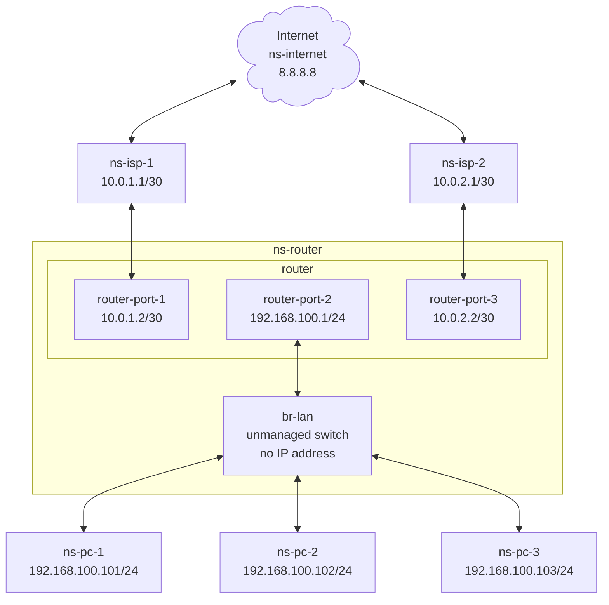

Policy Routing
===

## Table of Contents
- [Overview](#overview)
- [Requirements](#requirements)
- [Layout](#layout)
  - [Diagram](#diagram)
  - [Network Namespace](#network-namespace)
- [Hardware](#hardware-and-software)
- [Implementation](#implementation)
  - [Step 01 - Create the virtual machine](#step-01---create-the-virtual-machine)
  - [Step 02 - Access the vm](#step-02---access-the-vm)
  - [Step 03 - Create the required namespaces](#step-03---create-the-required-namespaces)
  - [Step 04 - Create the required links](#step-04---create-the-required-links)

## Overview
The lab uses multipass to create a virtual machine.
There will be 6 network namespaces that will be from various PC at home and a layer as mock internet.
The objective is to contrast not using policy routing vs using policy routing.
The PC at home will ping internet using the default route.
Then policy routing will be added.
The PC at home will ping internet again to show that policy routing has been implemented.


## Requirements
- [Multipass](https://canonical.com/multipass) installation.
- The vm will be created with default configuration of 1 core and 1 GB of RAM and 4 GB of disk space.

## Layout
### Diagram

### Network Namespace
- ns-internet - This will represent a common destination being accessed by different ISPs.
- ns-isp-1 and ns-isp-2 - The namespace `ns-isp-1` will be the default gateway for `ns-pc-1`, `ns-pc-2` and `ns-pc-3`. We will then introduce policy routing where `ns-pc-1` will be explicitly configured to use `ns-isp-1`, `ns-pc-2` will be explicitly configured to use `ns-isp-2` and `ns-pc-3` will use `ns-isp-1` implicitly as PC-3 was not explcitly configure with any policy routing and will use the default route.
- ns-router - The router has 3 ports:
  - 10.0.1.2/30 - This connects to `ns-isp-1`
  - 10.0.2.2/30 - This connects to `ns-isp-2`.
  - 192.168.101.1/24 - This is the gateway for `ns-pc-1`, `ns-pc-2` and `ns-pc-3`.
  - The `link` of type `bridge` will act as a non-managed switch, without any IP addresses where `ns-pc-1`, `ns-pc-2` and `ns-pc-3` connects to this `bridge`.
- ns-pc-1, ns-pc-2 and ns-pc-3 - These will represent individual devices that connect to the switch, `br-lan`.

## Hardware and Software
- This was tested on a `Beelink Mini S` with `Intel(R) N100` with `16 GB DDR4`.
- Also tested with `multipass` version `1.16.1` on M2 Mac Book Pro with 32 GB RAM.

## Implementation
### Step 01 - Create the virtual machine
Command:
```
echo  'package_update: true\npackage_upgrade: true\npackages:\n  - traceroute' | multipass launch --name lab1 --cloud-init -
```
Sample output:
```
$ echo  'package_update: true\npackage_upgrade: true\npackages:\n  - traceroute' | multipass launch --name lab1 --cloud-init -
Launched: lab1
```

### Step 02 - Access the vm
Command:
```
multipass shell lab1
```
Sample output:
```
$ multipass shell lab1
Welcome to Ubuntu 24.04.3 LTS (GNU/Linux 6.8.0-90-generic aarch64)

 * Documentation:  https://help.ubuntu.com
 * Management:     https://landscape.canonical.com
 * Support:        https://ubuntu.com/pro

 System information as of Tue Dec 23 18:35:49 MST 2025

  System load:             0.0
  Usage of /:              52.3% of 3.80GB
  Memory usage:            20%
  Swap usage:              0%
  Processes:               94
  Users logged in:         0
  IPv4 address for enp0s1: 192.168.2.8
  IPv6 address for enp0s1: fde8:bf1d:8203:1850:5054:ff:fe92:d4cc


Expanded Security Maintenance for Applications is not enabled.

0 updates can be applied immediately.

Enable ESM Apps to receive additional future security updates.
See https://ubuntu.com/esm or run: sudo pro status


To run a command as administrator (user "root"), use "sudo <command>".
See "man sudo_root" for details.

ubuntu@lab1:~$ 
```
### Step 03 - Create the required namespaces
```
ip netns list
sudo ip netns add ns-internet
sudo ip netns add ns-isp-1
sudo ip netns add ns-isp-2
sudo ip netns add ns-router
sudo ip netns add ns-pc-1
sudo ip netns add ns-pc-2
sudo ip netns add ns-pc-3
ip netns list
```
Sample output:
```
ubuntu@lab1:~$ ip netns list
ubuntu@lab1:~$ sudo ip netns add ns-internet
ubuntu@lab1:~$ sudo ip netns add ns-isp-1
ubuntu@lab1:~$ sudo ip netns add ns-isp-2
ubuntu@lab1:~$ sudo ip netns add ns-router
ubuntu@lab1:~$ sudo ip netns add ns-pc-1
ubuntu@lab1:~$ sudo ip netns add ns-pc-2
ubuntu@lab1:~$ sudo ip netns add ns-pc-3
ubuntu@lab1:~$ ip netns list
ns-pc-3
ns-pc-2
ns-pc-1
ns-router
ns-isp-2
ns-isp-1
ns-internet
ubuntu@lab1:~$ 
```
### Step 04 - Create the required links
Create link of type `bridge` named `br-lan` in the `ns-router` namespace:
```
sudo ip netns exec ns-router ip link show type bridge
sudo ip netns exec ns-router ip link add br-lan type bridge
sudo ip netns exec ns-router ip link show type bridge
```
Sample output:
```
ubuntu@lab1:~$ sudo ip netns exec ns-router ip link show type bridge
ubuntu@lab1:~$ sudo ip netns exec ns-router ip link add br-lan type bridge
ubuntu@lab1:~$ sudo ip netns exec ns-router ip link show type bridge
2: br-lan: <BROADCAST,MULTICAST> mtu 1500 qdisc noop state DOWN mode DEFAULT group default qlen 1000
    link/ether e6:ea:f2:15:cb:52 brd ff:ff:ff:ff:ff:ff
ubuntu@lab1:~$ 
```
---
Create link of type `bridge` named `br-internet` in the `ns-internet` namespace:
```
sudo ip netns exec ns-internet ip link show type bridge
sudo ip netns exec ns-internet ip link add br-internet type bridge
sudo ip netns exec ns-internet ip link show type bridge
```
Sample output:
```
ubuntu@lab1:~$ sudo ip netns exec ns-router ip link show type bridge
ubuntu@lab1:~$ sudo ip netns exec ns-router ip link add br-lan type bridge
ubuntu@lab1:~$ sudo ip netns exec ns-router ip link show type bridge
2: br-lan: <BROADCAST,MULTICAST> mtu 1500 qdisc noop state DOWN mode DEFAULT group default qlen 1000
    link/ether e6:ea:f2:15:cb:52 brd ff:ff:ff:ff:ff:ff
ubuntu@lab1:~$ 
```
---
- Create 3 links of type `veth` for the connections between `br-lan` and `ns-pc-1`/`ns-pc-2`/`ns-pc-3`.
- Create 2 links of type `veth` for the connections between `ns-router` and `ns-isp-1`/`ns-isp-2`.
- Create 2 links of type `veth` for the connections between `ns-internet` and `ns-isp-1`/`ns-isp-2`.
```
ip link show type veth
sudo ip link add veth-1a type veth peer name veth-1b
sudo ip link add veth-2a type veth peer name veth-2b
sudo ip link add veth-3a type veth peer name veth-3b
sudo ip link add veth-4a type veth peer name veth-4b
sudo ip link add veth-5a type veth peer name veth-5b
sudo ip link add veth-6a type veth peer name veth-6b
sudo ip link add veth-7a type veth peer name veth-7b
ip link show type veth
```
Sample output:
```
ubuntu@lab1:~$ sudo ip link show type veth
ubuntu@lab1:~$ sudo ip link add veth-1a type veth peer name veth-1b
ubuntu@lab1:~$ sudo ip link add veth-2a type veth peer name veth-2b
ubuntu@lab1:~$ sudo ip link add veth-3a type veth peer name veth-3b
ubuntu@lab1:~$ ip link show type veth
3: veth-1b@veth-1a: <BROADCAST,MULTICAST,M-DOWN> mtu 1500 qdisc noop state DOWN mode DEFAULT group default qlen 1000
    link/ether 12:66:18:78:7a:ed brd ff:ff:ff:ff:ff:ff
4: veth-1a@veth-1b: <BROADCAST,MULTICAST,M-DOWN> mtu 1500 qdisc noop state DOWN mode DEFAULT group default qlen 1000
    link/ether be:5a:61:4e:d4:14 brd ff:ff:ff:ff:ff:ff
5: veth-2b@veth-2a: <BROADCAST,MULTICAST,M-DOWN> mtu 1500 qdisc noop state DOWN mode DEFAULT group default qlen 1000
    link/ether 5a:59:ea:a2:36:5f brd ff:ff:ff:ff:ff:ff
6: veth-2a@veth-2b: <BROADCAST,MULTICAST,M-DOWN> mtu 1500 qdisc noop state DOWN mode DEFAULT group default qlen 1000
    link/ether be:c4:68:67:f0:5d brd ff:ff:ff:ff:ff:ff
7: veth-3b@veth-3a: <BROADCAST,MULTICAST,M-DOWN> mtu 1500 qdisc noop state DOWN mode DEFAULT group default qlen 1000
    link/ether 26:25:82:96:eb:ae brd ff:ff:ff:ff:ff:ff
8: veth-3a@veth-3b: <BROADCAST,MULTICAST,M-DOWN> mtu 1500 qdisc noop state DOWN mode DEFAULT group default qlen 1000
    link/ether 5a:64:f0:7f:ae:dd brd ff:ff:ff:ff:ff:ff
9: veth-4b@veth-4a: <BROADCAST,MULTICAST,M-DOWN> mtu 1500 qdisc noop state DOWN mode DEFAULT group default qlen 1000
    link/ether e6:c3:df:98:f6:e6 brd ff:ff:ff:ff:ff:ff
10: veth-4a@veth-4b: <BROADCAST,MULTICAST,M-DOWN> mtu 1500 qdisc noop state DOWN mode DEFAULT group default qlen 1000
    link/ether 6a:fc:f7:e4:a2:4c brd ff:ff:ff:ff:ff:ff
11: veth-5b@veth-5a: <BROADCAST,MULTICAST,M-DOWN> mtu 1500 qdisc noop state DOWN mode DEFAULT group default qlen 1000
    link/ether 8e:1f:dd:b0:0b:94 brd ff:ff:ff:ff:ff:ff
12: veth-5a@veth-5b: <BROADCAST,MULTICAST,M-DOWN> mtu 1500 qdisc noop state DOWN mode DEFAULT group default qlen 1000
    link/ether 76:30:41:37:9b:f0 brd ff:ff:ff:ff:ff:ff
13: veth-6b@veth-6a: <BROADCAST,MULTICAST,M-DOWN> mtu 1500 qdisc noop state DOWN mode DEFAULT group default qlen 1000
    link/ether f2:af:16:59:0b:14 brd ff:ff:ff:ff:ff:ff
14: veth-6a@veth-6b: <BROADCAST,MULTICAST,M-DOWN> mtu 1500 qdisc noop state DOWN mode DEFAULT group default qlen 1000
    link/ether ce:7d:00:84:04:59 brd ff:ff:ff:ff:ff:ff
15: veth-7b@veth-7a: <BROADCAST,MULTICAST,M-DOWN> mtu 1500 qdisc noop state DOWN mode DEFAULT group default qlen 1000
    link/ether 12:74:b5:fe:33:81 brd ff:ff:ff:ff:ff:ff
16: veth-7a@veth-7b: <BROADCAST,MULTICAST,M-DOWN> mtu 1500 qdisc noop state DOWN mode DEFAULT group default qlen 1000
    link/ether be:f2:8c:c1:38:c9 brd ff:ff:ff:ff:ff:ff
```
---
Assign the link to the correct namespaces:
```
ip link show type veth
sudo ip netns exec ns-router ip link show type veth
sudo ip netns exec ns-pc-1 ip link show type veth
sudo ip netns exec ns-pc-2 ip link show type veth
sudo ip netns exec ns-pc-3 ip link show type veth
sudo ip netns exec ns-isp-1 ip link show type veth
sudo ip netns exec ns-isp-2 ip link show type veth
sudo ip netns exec ns-internet ip link show type veth

sudo ip link set veth-1a netns ns-pc-1
sudo ip link set veth-2a netns ns-pc-2
sudo ip link set veth-3a netns ns-pc-3
sudo ip link set veth-1b netns ns-router
sudo ip link set veth-2b netns ns-router
sudo ip link set veth-3b netns ns-router
sudo ip link set veth-4a netns ns-router
sudo ip link set veth-5a netns ns-router
sudo ip link set veth-4b netns ns-isp-1
sudo ip link set veth-5b netns ns-isp-2
sudo ip link set veth-6a netns ns-isp-1
sudo ip link set veth-7a netns ns-isp-2
sudo ip link set veth-6b netns ns-internet
sudo ip link set veth-7b netns ns-internet

ip link show type veth
sudo ip netns exec ns-router ip link show type veth
sudo ip netns exec ns-pc-1 ip link show type veth
sudo ip netns exec ns-pc-2 ip link show type veth
sudo ip netns exec ns-pc-3 ip link show type veth
sudo ip netns exec ns-isp-1 ip link show type veth
sudo ip netns exec ns-isp-2 ip link show type veth
sudo ip netns exec ns-internet ip link show type veth
```
Sample output:
```
ubuntu@lab1:~$ ip link show type veth
3: veth-1b@veth-1a: <BROADCAST,MULTICAST,M-DOWN> mtu 1500 qdisc noop state DOWN mode DEFAULT group default qlen 1000
    link/ether 12:66:18:78:7a:ed brd ff:ff:ff:ff:ff:ff
4: veth-1a@veth-1b: <BROADCAST,MULTICAST,M-DOWN> mtu 1500 qdisc noop state DOWN mode DEFAULT group default qlen 1000
    link/ether be:5a:61:4e:d4:14 brd ff:ff:ff:ff:ff:ff
5: veth-2b@veth-2a: <BROADCAST,MULTICAST,M-DOWN> mtu 1500 qdisc noop state DOWN mode DEFAULT group default qlen 1000
    link/ether 5a:59:ea:a2:36:5f brd ff:ff:ff:ff:ff:ff
6: veth-2a@veth-2b: <BROADCAST,MULTICAST,M-DOWN> mtu 1500 qdisc noop state DOWN mode DEFAULT group default qlen 1000
    link/ether be:c4:68:67:f0:5d brd ff:ff:ff:ff:ff:ff
7: veth-3b@veth-3a: <BROADCAST,MULTICAST,M-DOWN> mtu 1500 qdisc noop state DOWN mode DEFAULT group default qlen 1000
    link/ether 26:25:82:96:eb:ae brd ff:ff:ff:ff:ff:ff
8: veth-3a@veth-3b: <BROADCAST,MULTICAST,M-DOWN> mtu 1500 qdisc noop state DOWN mode DEFAULT group default qlen 1000
    link/ether 5a:64:f0:7f:ae:dd brd ff:ff:ff:ff:ff:ff
9: veth-4b@veth-4a: <BROADCAST,MULTICAST,M-DOWN> mtu 1500 qdisc noop state DOWN mode DEFAULT group default qlen 1000
    link/ether e6:c3:df:98:f6:e6 brd ff:ff:ff:ff:ff:ff
10: veth-4a@veth-4b: <BROADCAST,MULTICAST,M-DOWN> mtu 1500 qdisc noop state DOWN mode DEFAULT group default qlen 1000
    link/ether 6a:fc:f7:e4:a2:4c brd ff:ff:ff:ff:ff:ff
11: veth-5b@veth-5a: <BROADCAST,MULTICAST,M-DOWN> mtu 1500 qdisc noop state DOWN mode DEFAULT group default qlen 1000
    link/ether 8e:1f:dd:b0:0b:94 brd ff:ff:ff:ff:ff:ff
12: veth-5a@veth-5b: <BROADCAST,MULTICAST,M-DOWN> mtu 1500 qdisc noop state DOWN mode DEFAULT group default qlen 1000
    link/ether 76:30:41:37:9b:f0 brd ff:ff:ff:ff:ff:ff
13: veth-6b@veth-6a: <BROADCAST,MULTICAST,M-DOWN> mtu 1500 qdisc noop state DOWN mode DEFAULT group default qlen 1000
    link/ether 46:74:ff:57:f2:8d brd ff:ff:ff:ff:ff:ff
14: veth-6a@veth-6b: <BROADCAST,MULTICAST,M-DOWN> mtu 1500 qdisc noop state DOWN mode DEFAULT group default qlen 1000
    link/ether 8e:9d:97:8c:03:5b brd ff:ff:ff:ff:ff:ff
15: veth-7b@veth-7a: <BROADCAST,MULTICAST,M-DOWN> mtu 1500 qdisc noop state DOWN mode DEFAULT group default qlen 1000
    link/ether c2:71:c4:78:0d:f0 brd ff:ff:ff:ff:ff:ff
16: veth-7a@veth-7b: <BROADCAST,MULTICAST,M-DOWN> mtu 1500 qdisc noop state DOWN mode DEFAULT group default qlen 1000
    link/ether 1e:86:c8:a9:38:b7 brd ff:ff:ff:ff:ff:ff
ubuntu@lab1:~$ sudo ip netns exec ns-router ip link show type veth
ubuntu@lab1:~$ sudo ip netns exec ns-pc-1 ip link show type veth
ubuntu@lab1:~$ sudo ip netns exec ns-pc-2 ip link show type veth
ubuntu@lab1:~$ sudo ip netns exec ns-pc-3 ip link show type veth
ubuntu@lab1:~$ sudo ip netns exec ns-isp-1 ip link show type veth
ubuntu@lab1:~$ sudo ip netns exec ns-isp-2 ip link show type veth
ubuntu@lab1:~$ sudo ip netns exec ns-internet ip link show type veth
ubuntu@lab1:~$ sudo ip link set veth-1a netns ns-pc-1
ubuntu@lab1:~$ sudo ip link set veth-2a netns ns-pc-2
ubuntu@lab1:~$ sudo ip link set veth-3a netns ns-pc-3
ubuntu@lab1:~$ sudo ip link set veth-1b netns ns-router
ubuntu@lab1:~$ sudo ip link set veth-2b netns ns-router
ubuntu@lab1:~$ sudo ip link set veth-3b netns ns-router
ubuntu@lab1:~$ sudo ip link set veth-4a netns ns-router
ubuntu@lab1:~$ sudo ip link set veth-5a netns ns-router
ubuntu@lab1:~$ sudo ip link set veth-4b netns ns-isp-1
ubuntu@lab1:~$ sudo ip link set veth-5b netns ns-isp-2
ubuntu@lab1:~$ sudo ip link set veth-6a netns ns-isp-1
ubuntu@lab1:~$ sudo ip link set veth-7a netns ns-isp-2
ubuntu@lab1:~$ sudo ip link set veth-6b netns ns-internet
ubuntu@lab1:~$ sudo ip link set veth-7b netns ns-internet
ubuntu@lab1:~$ ip link show type veth
ubuntu@lab1:~$ sudo ip netns exec ns-router ip link show type veth
3: veth-1b@if4: <BROADCAST,MULTICAST> mtu 1500 qdisc noop state DOWN mode DEFAULT group default qlen 1000
    link/ether 12:66:18:78:7a:ed brd ff:ff:ff:ff:ff:ff link-netns ns-pc-1
5: veth-2b@if6: <BROADCAST,MULTICAST> mtu 1500 qdisc noop state DOWN mode DEFAULT group default qlen 1000
    link/ether 5a:59:ea:a2:36:5f brd ff:ff:ff:ff:ff:ff link-netns ns-pc-2
7: veth-3b@if8: <BROADCAST,MULTICAST> mtu 1500 qdisc noop state DOWN mode DEFAULT group default qlen 1000
    link/ether 26:25:82:96:eb:ae brd ff:ff:ff:ff:ff:ff link-netns ns-pc-3
10: veth-4a@if9: <BROADCAST,MULTICAST> mtu 1500 qdisc noop state DOWN mode DEFAULT group default qlen 1000
    link/ether 6a:fc:f7:e4:a2:4c brd ff:ff:ff:ff:ff:ff link-netns ns-isp-1
12: veth-5a@if11: <BROADCAST,MULTICAST> mtu 1500 qdisc noop state DOWN mode DEFAULT group default qlen 1000
    link/ether 76:30:41:37:9b:f0 brd ff:ff:ff:ff:ff:ff link-netns ns-isp-2
ubuntu@lab1:~$ sudo ip netns exec ns-pc-1 ip link show type veth
4: veth-1a@if3: <BROADCAST,MULTICAST> mtu 1500 qdisc noop state DOWN mode DEFAULT group default qlen 1000
    link/ether be:5a:61:4e:d4:14 brd ff:ff:ff:ff:ff:ff link-netns ns-router
ubuntu@lab1:~$ sudo ip netns exec ns-pc-2 ip link show type veth
6: veth-2a@if5: <BROADCAST,MULTICAST> mtu 1500 qdisc noop state DOWN mode DEFAULT group default qlen 1000
    link/ether be:c4:68:67:f0:5d brd ff:ff:ff:ff:ff:ff link-netns ns-router
ubuntu@lab1:~$ sudo ip netns exec ns-pc-2 ip link show type veth
6: veth-2a@if5: <BROADCAST,MULTICAST> mtu 1500 qdisc noop state DOWN mode DEFAULT group default qlen 1000
    link/ether be:c4:68:67:f0:5d brd ff:ff:ff:ff:ff:ff link-netns ns-router
ubuntu@lab1:~$ sudo ip netns exec ns-pc-3 ip link show type veth
8: veth-3a@if7: <BROADCAST,MULTICAST> mtu 1500 qdisc noop state DOWN mode DEFAULT group default qlen 1000
    link/ether 5a:64:f0:7f:ae:dd brd ff:ff:ff:ff:ff:ff link-netns ns-router
ubuntu@lab1:~$ sudo ip netns exec ns-isp-1 ip link show type veth
9: veth-4b@if10: <BROADCAST,MULTICAST> mtu 1500 qdisc noop state DOWN mode DEFAULT group default qlen 1000
    link/ether e6:c3:df:98:f6:e6 brd ff:ff:ff:ff:ff:ff link-netns ns-router
14: veth-6a@if13: <BROADCAST,MULTICAST> mtu 1500 qdisc noop state DOWN mode DEFAULT group default qlen 1000
    link/ether 8e:9d:97:8c:03:5b brd ff:ff:ff:ff:ff:ff link-netns ns-internet
ubuntu@lab1:~$ sudo ip netns exec ns-isp-2 ip link show type veth
11: veth-5b@if12: <BROADCAST,MULTICAST> mtu 1500 qdisc noop state DOWN mode DEFAULT group default qlen 1000
    link/ether 8e:1f:dd:b0:0b:94 brd ff:ff:ff:ff:ff:ff link-netns ns-router
16: veth-7a@if15: <BROADCAST,MULTICAST> mtu 1500 qdisc noop state DOWN mode DEFAULT group default qlen 1000
    link/ether 1e:86:c8:a9:38:b7 brd ff:ff:ff:ff:ff:ff link-netns ns-internet
ubuntu@lab1:~$ sudo ip netns exec ns-internet ip link show type veth
13: veth-6b@if14: <BROADCAST,MULTICAST> mtu 1500 qdisc noop state DOWN mode DEFAULT group default qlen 1000
    link/ether 46:74:ff:57:f2:8d brd ff:ff:ff:ff:ff:ff link-netns ns-isp-1
15: veth-7b@if16: <BROADCAST,MULTICAST> mtu 1500 qdisc noop state DOWN mode DEFAULT group default qlen 1000
    link/ether c2:71:c4:78:0d:f0 brd ff:ff:ff:ff:ff:ff link-netns ns-isp-2
```
---
Assign the links in the `ns-router` namespace
